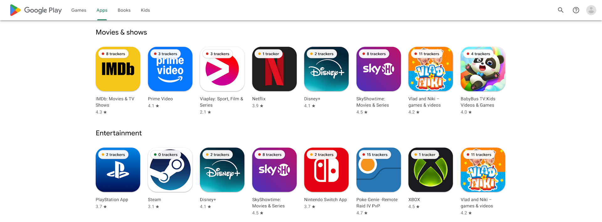
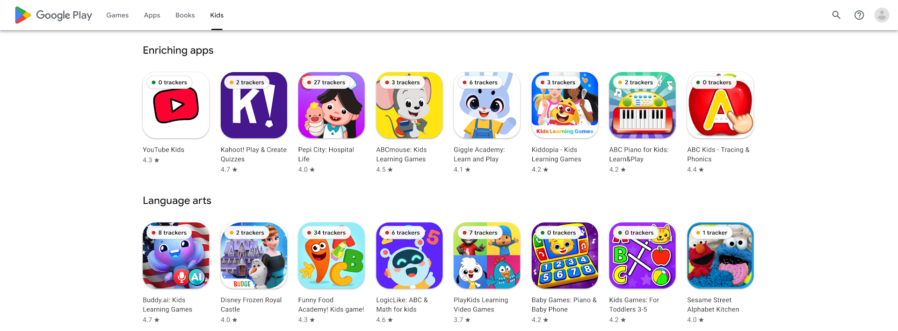
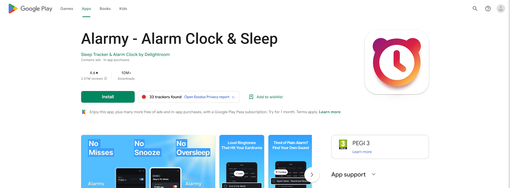
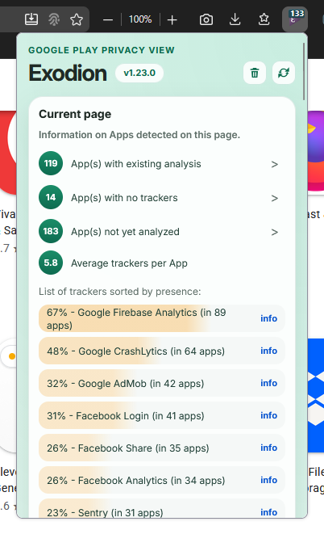
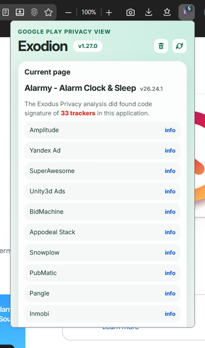

<h1 align="center">
   Exodion
</h1>

Browser extension that brings [Exodus Privacy](https://exodus-privacy.eu.org/) tracker data directly into Google Play. It shows tracker counts on Android app pages, listing pages, categories, search-style views, and provides a compact popup summary for the current Google Play page.

Exodion is a modern continuation of the original Exodify idea, updated for current Google Play markup and built with separate **Chrome/Chromium** and **Firefox** manifests.

## ✨ Features

### Google Play listing pages

- Adds compact tracker badges to app cards on Google Play listing pages.
- Supports app and game landing pages, search results, category pages, and carousel rows.
- Reuses cached reports to avoid refetching the same app data too aggressively.
- Shows `Unknown` when Exodus Privacy has no available report for an app yet.
- Shows the extension badge count as the number of apps on the current page with an available analysis result.






### Google Play app pages

- Shows the tracker count next to the main Install action.
- Links directly to the matching Exodus Privacy report when one exists.
- Shows a loading state while report data is being fetched.
- Allows manual refresh for the current app report.



### Popup summary

- Summarizes tracker information found on the current Google Play page.
- Shows app counts grouped by analysis status.
- Opens category views for analyzed apps, apps with no trackers, and apps not yet analyzed.
- Links app IDs in category views back to their Google Play pages.
- Provides quick actions to clear the Exodion cache or rescan the current page.

<p align="center">
  
  
</p>

## 🧠 Caching

Exodion keeps a local browser cache to reduce repeated Exodus Privacy requests and to stay useful when the Exodus Privacy API is temporarily unavailable.

- App reports with analysis are cached for 7 days.
- Apps without an available report are cached for 6 hours.
- The Exodus Privacy tracker directory is cached for 30 days.
- If refreshing the tracker directory fails, Exodion falls back to the stale cached directory when available.
- The popup cache button clears both the app report cache and the tracker directory cache.

## 🚀 Installation

### Option 1: Install from the store

Store links will be added after publication.

### Option 2: Load the unpacked extension

First, create a local `config.json` file in the project root:

```json
{
  "apiToken": "YOUR_EXODUS_PRIVACY_API_TOKEN"
}
```

Then build the project. Just run:

```
RUN_build_no_pack.bat
```

Or through the console:

```powershell
node .\build.js --debug
```

#### Chrome / Brave / Edge

1. Open `chrome://extensions`
2. Enable **Developer mode**
3. Click **Load unpacked**
4. Select `builds\chrome`

#### Firefox

1. Open `about:debugging#/runtime/this-firefox`
2. Click **Load Temporary Add-on**
3. Select `builds\firefox\manifest.json`

## 📦 Packaging

To create packaged zip archives for both browser targets:

Run:

```
RUN_build.bat
```

Or through the console:

```powershell
node .\build.js
```

The output is written to:

```text
builds\packed
```

The build script copies shared files, applies the browser-specific manifest, replaces `@@API_TOKEN` with the local token from `config.json`, and creates separate packages for Chrome/Chromium and Firefox.

## ⚙️ Development Notes

- `config.json` is intentionally ignored by Git because it contains the local Exodus Privacy API token.
- The source token placeholder should remain as `@@API_TOKEN` in committed code.

## ⚠️ Notes & Limitations

- Exodion depends on Exodus Privacy report availability, but cached data can remain usable during temporary Exodus Privacy API issues.
- Some apps may show as `Unknown` until Exodus Privacy has an analysis for them.
- Google Play markup changes can affect badge placement and may require extension updates.
- Local Chrome CRX installation is restricted by Chrome on Windows and macOS, so unpacked development builds are the practical local testing path.
